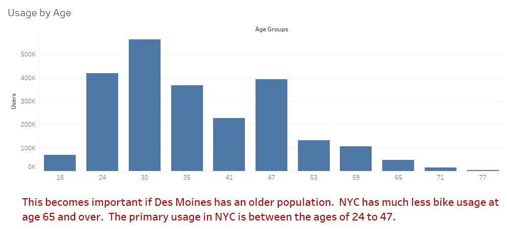

# Bikesharing
Link to Tableau Story [NYC Citibike](https://public.tableau.com/views/NYCCitibikeChallenge_16176058216610/NYCCitiBike?:language=en&:display_count=y&publish=yes&:origin=viz_share_link) for Module 14

## Purpose of Project
* To use Tableau to visualize the story of NYC Citibike usage to highlight useful information that could lead to starting CitiBike in other cities, in this case Des Moines, Iowa.

## Results - Analysis
*  Gender - Who uses the bike service?
*  Time of day - When are the peak hours of usage?  When are the off peak hours so that maintainence can be performed.
*  Where are the bikes picked up and returned.  This will matter during the maintainence hours to redistribute the bikes to make sure the potential users have one available at the beginning of a new day.
*  Age - Recalculation of Birthdate to Age and sorted into bins to show how old the user is.  This is important if Des Moines has an older age demographic combined with a lower population it could be detrimental to business.

*  When to maintain the fleet is very important to keeping customers.  People do not like to ride around on junk, nor do they want to search for a bike when trying to get around, so making sure the bikes are available in key areas will take daily redistributions causing higherly labor costs in more rural areas.

## Summary
### High Level Summary
*  This was a fun project that turned boring numbers into colorful visualizations.  The who, when, where, how old and how to maintain the fleet are listed in captions to give quick talking points to a the presentation.

### Suggested Future Analysis
* As llsted above. age is an important demographic.  More analysis was created and showed that in NYC, users are fairly young.  If Des Moines has an older age demographic, this could problematic for higher usage and subscribers.
* NYC is densely populated, much more than Des Moines and has more people per square mile.  It is glaring when the Top Start / End locations show that most of the usage is on the island of Manhattan.
* Comparing populations - NYC has more "unknown" gender users than the population of Des Moines.

### Side Note
* I am of the opinion that what is on a "slide"(story) should only remind the presenter of what he/she should be talking about.  This visualization tool is perfect for me.
